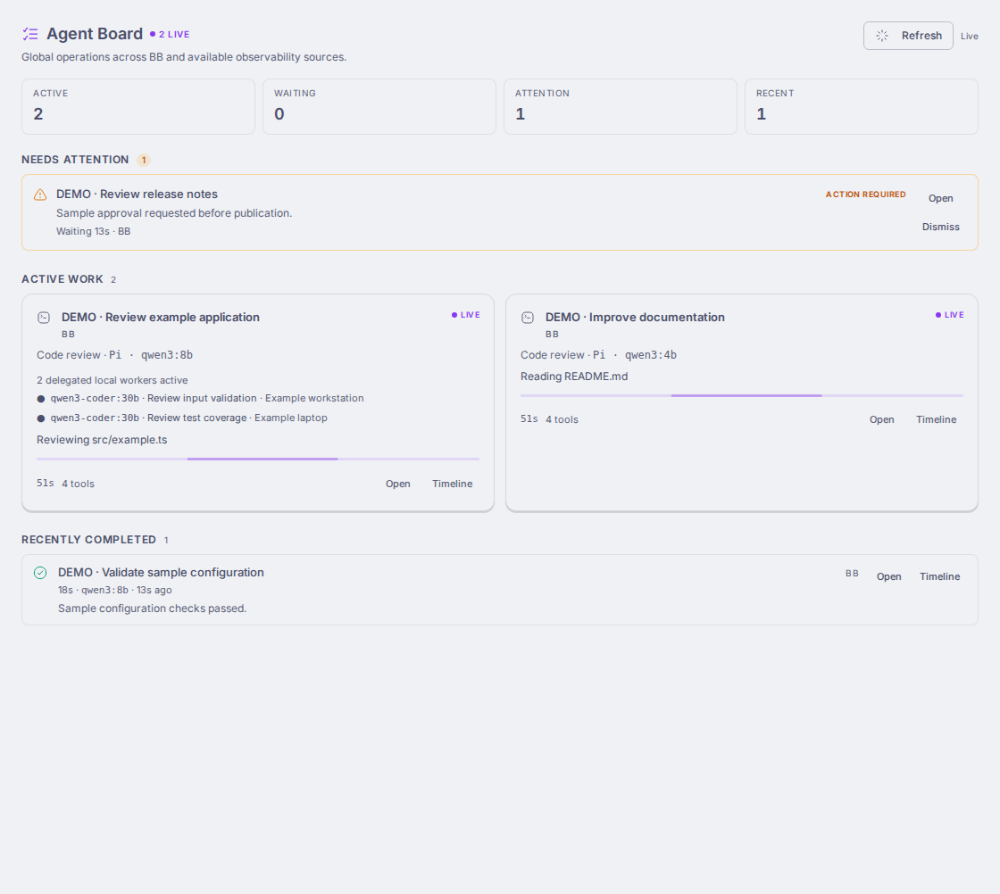

# Agent Board

Live execution observability for BB. See what agents are doing, which models
and tools they use, which workers are running, what needs attention, and what
just completed.



Screenshots show the real plugin UI with clearly labeled synthetic data.

## Why Agent Board

Task management records what should happen. Orchestration starts and coordinates
work. Agent Board observes execution through supported BB APIs and optional
public plugin contracts. A Kanban board is one view of that work; automatic
focus and the global dashboard offer other views of the same bounded state.

## Features

- **Global Operations Dashboard:** active work, Needs Attention, and recent completion.
- **Single-Agent Focus:** activity and discrete lifecycle state for one execution.
- **Multi-Agent Kanban:** live state for concurrent agents and workers.
- **Needs Attention:** structured waiting/failure states and persistent dismissal.
- **Execution Timeline:** bounded operational events, loaded when opened.
- Native BB threads, workflows, delegations, models and tools.
- Optional Ollama Fleet and Redteam observation.
- Mobile layouts, keyboard controls, and reduced-motion support.

## Screenshots

[Global dashboard and Fleet workers](docs/screenshots/global.png) ·
[Execution timeline](docs/screenshots/timeline.png) ·
[Mobile (412 px)](docs/screenshots/mobile-412.png) ·
[Mobile (360 px)](docs/screenshots/mobile-360.png).
See [capture requirements and status](docs/screenshots.md) for remaining assets
and the distinction between fixture media and live runtime evidence.

## Installation

First public beta: **0.6.1**. Install the released Git tag with BB:

```sh
bb plugin install git:https://github.com/aaronphifer/bb-plugin-agent-board.git@v0.6.1
```

BB's managed Git installer installs runtime dependencies and builds the frontend
and server from source. Git releases intentionally omit `dist/`. A local path
install uses your existing dependencies; prepare a checkout with:

```sh
npm ci
bb plugin build
bb plugin install .
```

Neither Fleet nor Redteam is required. Declared compatibility is BB >=0.40 and
SDK >=0.4.21; the development SDK is pinned to 0.4.34. See the honest
[compatibility matrix](RELEASE_AUDIT.md), including historical runtime evidence.

## Usage

Global: sidebar → **Agent Board**. Scoped: thread → **Agent Board** action.
A scoped board automatically uses **Single-Agent Focus** for one logical active execution and
a **Multi-Agent** view for independent active executions or concurrent Fleet workers. Focus shows
the current model, tools, public progress updates, and lifecycle state.
**Needs Attention** collects structured approvals, input requests, and failures.
Open **Timeline** for bounded start, model, tool, public-update, and terminal events. Dismiss attention items after
review; dismissal changes presentation state, not the underlying execution.

```sh
bb agent-board show <thread-id>
bb agent-board show <thread-id> --json
```

## Ollama Fleet Integration

**Optional: [Ollama Fleet >=0.6.0](https://github.com/aaronphifer/bb-plugin-ollama-fleet)**
enables live visibility into delegated local jobs. Agent Board calls `fleet_observability_snapshot`
through public `bb.sdk.plugins.callRpc`, validates a local wire schema, and
maps safe metadata into its execution model. It imports no Fleet code.

Jobs with exact origin linkage nest under their BB parent. Jobs without origin
appear independently. Actual model/server state comes from Fleet. Linked
workers do not replace the parent's model or inflate global execution counts.
Missing, disabled, old, malformed, failed, or truncated sources are handled
without making Fleet a requirement. Raw prompts/answers never become public updates.

## Redteam Integration

**Optional.** Redteam must expose public `observability_snapshot` schema version 1.
Agent Board uses a local schema, imports no Redteam modules, and shows real phases,
models, tools and bounded operation metadata when supplied. Source failure is
isolated from native BB observation; source capabilities vary.

## Privacy / Security

Agent Board uses supported public BB plugin APIs, never direct BB database
access or private `@bb/*` imports. It excludes hidden reasoning/thinking and raw
Fleet prompts/results. Timelines and activity are bounded; previews are truncated
and common credential forms redacted. This is defense in depth: public assistant
updates, task titles, paths and configured names can still contain private content.
Only share screenshots after reviewing them.

Attention dismissal is persisted presentation state. Collection caches are
bounded and disposable. Optional integrations fail gracefully. Plugins run with
BB's trust. See [SECURITY.md](SECURITY.md).

## Architecture

```text
BB source ────────┐
Redteam source ───┼─> normalized execution model ─> UI
Fleet source ────┘
```

[Architecture and adapter details](docs/architecture.md) document source semantics,
cache behavior, polling, lifecycle reconciliation and privacy boundaries.

## Performance / Bounds

Scoped collection caps threads at 24 and depth at 4. Global discovery requests
at most 64 rows, enriches at most 14 representatives with concurrency 4, and
shows at most 8 active, 6 recent and 8 attention items. Timeline output defaults
to 50 events and caps at 80. Fleet requests cap at 20 jobs; truncated results
are reported. Active-source polling is shared and expires unused watches.
This is a bounded latest view, not a persistent history database.

## Known Limitations

- The current public BB plugin SDK does not expose a supported system/push notification delivery API.
  Agent Board intentionally does not implement unsupported browser push/service-worker hacks.
- Fleet worker visibility requires Fleet >=0.6.0; no integration is mandatory.
- Timeline history is bounded and varies with source capabilities.
- Fleet has no token stream or attempt-history API; observation never invents those details.
- Physical Android release verification remains separate from automated DOM tests.

## Development

```sh
npm ci
npm test
npm run typecheck
bb plugin build
```

See [CONTRIBUTING.md](CONTRIBUTING.md), [CHANGELOG.md](CHANGELOG.md), and
[release evidence](RELEASE_AUDIT.md).

## License

[MIT](LICENSE), Copyright (c) 2026 Aaron Phifer. Third-party code retains its
own [notices and licenses](THIRD_PARTY_NOTICES.md).
